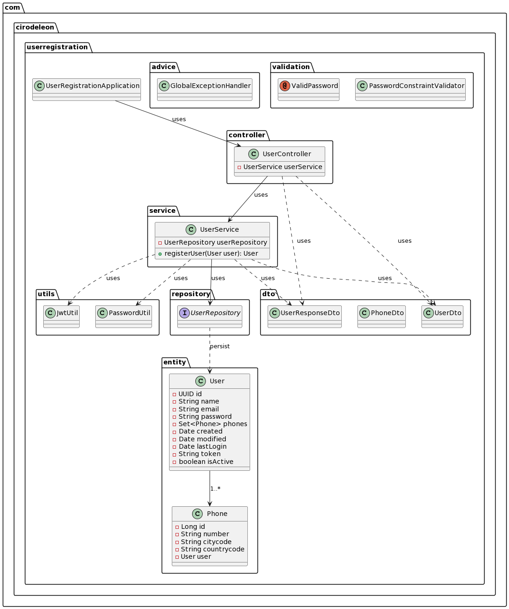

# Aplicación de Registro de Usuarios

## Descripción
Este proyecto es una aplicación Spring Boot que expone una API RESTful para el registro de usuarios. Implementa validaciones para el correo electrónico y la contraseña, autenticación con tokens JWT y utiliza una base de datos H2 en memoria para la persistencia de datos. El objetivo principal es permitir el registro de usuarios junto con sus números de teléfono en un formato específico.

## Tecnologías Utilizadas
- Java 17
- Spring Boot
- Spring Data JPA
- H2 Database
- Lombok
- JWT (JSON Web Token)

## Requisitos
Para ejecutar este proyecto se necesita tener instalado:
- JDK 17 o superior
- Maven

## Diagrama 




## Instalación y Ejecución sin docker
Sigue los siguientes pasos para instalar y ejecutar el proyecto:

1. Clonar el repositorio:
```
git clone https://github.com/CiroDeLeon/backend-user-registration.git
```

2. Navegar al directorio del proyecto:
```
cd backend-user-registration
```
```
cd user-registration
```

3. Generar el jar con Maven con el siguiente comando:
```
mvn clean install
```

4. ingresas a la carpeta target con el siguiente comando:
```
cd target
```

5. ejecutas el jar
```
java -jar app.jar
```

## Instalación y ejecucion usando docker

1. Clonar el repositorio:
```
git clone https://github.com/CiroDeLeon/backend-user-registration.git
```

2. Navegar al directorio del proyecto:
```
cd backend-user-registration
```
```
cd user-registration
```

3. Creamos la imagen
```
docker build -t  user-registration-img .
```

4. Creamos un contenedor
```
docker run -p 8080:8080 user-registration-img
```

5. si deseas crear otro contenedor que corra sobre otro puerto,en este caso en el 8081 el comando seria:
```
docker run -p 8081:8080 user-registration-img
```


Una vez iniciada, la aplicación estará disponible en `http://localhost:8080`.

puedes acceder a la documentacion swagger `http://localhost:8080/swagger-ui/index.html`


puedes acceder a la h2-console `http://localhost:8080/h2-console`

JDBC URL
```
jdbc:h2:mem:testdb;DB_CLOSE_DELAY=-1;DB_CLOSE_ON_EXIT=FALSE
```

User Name
```
sa
```

password
```
123456
```

## Uso de la API
Para registrar un nuevo usuario, enviar una petición POST a `http://localhost:8080/users/register` con el siguiente cuerpo JSON:

```json
{
  "name": "Juan Rodriguez",
  "email": "juan@dominio.cl",
  "password": "10784054P@ta",
  "phones": [
    {
      "number": "1234567",
      "citycode": "1",
      "countrycode": "57"
    }
  ]
}
```
Respuestas
Éxito: Código de estado HTTP 200 OK y un cuerpo JSON con los datos del usuario, incluyendo id, created, modified, lastLogin, token, y isActive.
Error: Código de estado HTTP adecuado y un cuerpo JSON con el mensaje de error.

Configuración
La configuración de la aplicación se puede ajustar en el archivo src/main/resources/application.properties. Esto incluye la conexión a la base de datos, la configuración de JPA y la expresión regular para la validación de la contraseña.